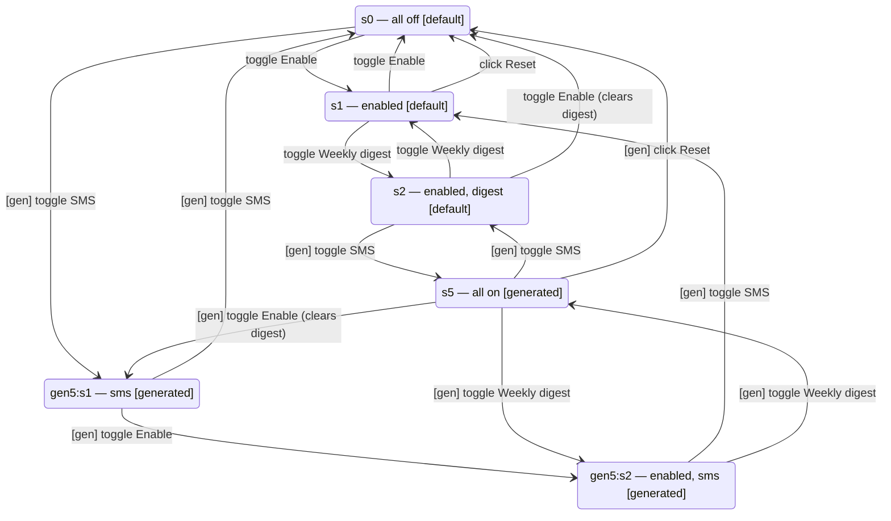

# How exploration works, end to end

A walkthrough of the four things the tool decides — which props to pass, which
interactions to try, which commits count as states, and which edges connect them —
using one component throughout: `benchmarks/mui-notification-settings/`. Its generated
report is `examples/MuiNotificationSettings.html`, and every number below comes from
`examples/MuiNotificationSettings.json`, not from prose.

It was picked because it exercises the two cases that are easy to describe wrongly:
states that are reached under several prop assignments and must collapse to one node,
and states that only exist under a generated assignment.

## The component

```tsx
export interface MuiNotificationSettingsProps {
  plan: "free" | "pro";
}

export function MuiNotificationSettings({ plan }: MuiNotificationSettingsProps) {
  const [enabled, setEnabled] = useState(false);
  const [digest, setDigest] = useState(false);
  const [smsAlerts, setSmsAlerts] = useState(false);
  // Switch "Enable notifications"  -> sets enabled; clears digest when switched off
  // Checkbox "Weekly digest"       -> disabled while !enabled
  // Checkbox "SMS alerts"          -> rendered only when plan === "pro"
  // Button   "Reset"               -> all three back to false
}
```

Three boolean hooks, so eight combinations exist arithmetically. Six are reachable, and
the tool finds exactly those six. The two it doesn't find are unreachable rather than
missed: `digest` can never be true while `enabled` is false, because the checkbox is
disabled in that state and switching notifications off clears it.

## 1. Props: sampled from the declared type

`src/props/propsToArbitraries.ts` reads `MuiNotificationSettingsProps` with ts-morph and
maps each prop to a fast-check arbitrary. `plan` is a string-literal union, so it becomes
`fc.constantFrom("free", "pro")` — the highest-value inference case, and the one that
finds hidden branches.

Function props are never inferred. `mapPropType` throws and names the prop rather than
synthesising a no-op callback, because a silent no-op produces a graph that quietly
misses every transition gated behind that callback firing. `propOverrides` in the config
module is the escape hatch, and it wins outright over inference.

`buildAssignments` then produces the run list. With `--sample-count 5 --vary-per-prop 2`
this component gets 8 assignments:

| source | count | what it is |
|---|---|---|
| `example` | 1 | `{ plan: "free" }` from `examples/configs/mui-notification-settings.config.ts` |
| `vary-one` | 2 | one prop varied, everything else held at its example value |
| `random` | 5 | `fc.record` over every prop at once |

Each assignment gets its own complete `exploreComponent` run with its own graph. Props
are deliberately kept out of state identity, so sampling 8 assignments does not multiply
the state space by 8 — only the merge step at the end combines them.

Here, four of the eight generated assignments happened to draw `plan: "free"` again, so
they reproduce the example run's graph exactly. That is not waste to hide; it is what
makes the dedupe below observable.

## 2. Actions: enumerated from the rendered DOM

`discoverActions` (`src/explore/actions.ts`) runs fresh at every state and after every
replay. It has no memory and no notion of which action is interesting — it returns
everything it can find.

Four queries map selectors to action kinds: clickables (`button`, `a[href]`,
`[role="button"]`, input buttons), checkboxes and radios, text fields, and `<select>`
options. A text field produces one action *per fill-pool value* rather than one per
keystroke; the default pool is empty / plausible / likely-invalid, kept small because
every pool value is a full action replayed on each backtrack. Function props are added
separately as `invokeProp` actions, since nothing rendered can reveal them.

At this component's initial state under `plan: "pro"`, discovery returns:

```
available:
  click:button:"Reset"
  toggle:switch:"Enable notifications"
  toggle:checkbox:"SMS alerts"
unavailable:
  toggle:checkbox:"Weekly digest"   reason: disabled
```

Two things worth reading off that list.

**Ids are role plus accessible name**, never DOM position. MUI's Switch carries
`role="switch"` so it lands as `toggle:switch:"Enable notifications"`, while the
checkboxes are `toggle:checkbox:...`. Names come from the enclosing `FormControlLabel`
text via the `closest("label")` rule in `computeAccessibleName`. None of this is an MUI
special case. It matters because an id recorded during one mount must be findable in a
freshly-discovered list after a *different* mount — that is the precondition for replay.

**Disabled and hidden elements are reported, not dropped.** The digest checkbox goes to
`unavailable` with reason `disabled`, which is how the report can tell you the control
exists but was unreachable from here. Across the whole run that entry is recorded 8
times against `s0` and twice against `gen5:s1` — once per visit, since discovery has no
memory.

## 3. States: hook values, abstracted, deduped by content

Each observed commit is read off the fiber through the React DevTools hook, giving the
component's own `useState` values with names resolved from source by ts-morph:
`{enabled, digest, smsAlerts}`. `AdaptiveAbstraction.observe` turns those into a state
key — bucketing free-ranging values, keeping small enums verbatim, and pruning hooks
whose changes never affect rendered output.

For this component nothing is demoted and nothing is pruned. The report says so
explicitly:

```json
"demotedHooks": [], "prunedHooks": [],
"domPruneReport": [
  { "hookName": "digest",    "variedNoDomCount": 0, "everCoVaried": true,  "pruned": false },
  { "hookName": "enabled",   "variedNoDomCount": 0, "everCoVaried": true,  "pruned": false },
  { "hookName": "smsAlerts", "variedNoDomCount": 0, "everCoVaried": false, "pruned": false }
]
```

That report is worth a pause, because this component is exactly where the pruner's input
was once wrong. The DOM fingerprint reads `checked` and `value` from the live DOM
property, not the attribute — React sets the property on a controlled input and leaves
the attribute at its initial value. Before that fix, ticking a checkbox changed no
fingerprint, `digest` and `smsAlerts` looked like state that never affects rendering,
the pruner deleted both, and this graph collapsed from six states to two. See
`benchmarks/mui-notification-settings/MuiNotificationSettings.expected.ts`.

State **ids** (`s0`, `s1`, …) are per-run counters assigned in first-observation order,
so they mean nothing across runs. The merge keys states by *content* instead — a
canonical string of the hook fields — which is what makes the same state reached under
six different assignments collapse into one node.

## 4. Edges: a byproduct of settling, one chain at a time

No code inspects the graph to decide where edges go. `processChain`
(`src/explore/engine.ts`) is called once per action performed, plus once for the root
mount, and emits an edge between every consecutive commit in the chain that action
produced:

- step 0 → `kind: "user"`, carrying the `ActionRef`
- every later step → `kind: "auto"`, with `driver: "timer" | "microtask"`

This component is synchronous, so every chain is one commit long and every edge is a
`user` edge. In `FetchList` the same loop produces `user` into `loading` and `auto` into
`loaded`, which is how transient states get connected instead of being skipped.

Traversal is depth-first over a stack of `(state, untried action)` pairs. Returning to a
state means unmounting, remounting fresh under the same props, and re-executing that
state's recorded witness — never restoring state into the fiber, which would reintroduce
the unreachability problem and could not restore timers or module-level variables
anyway. That replay is why the run costs 342 actions to produce a 6-state graph, and why
`src/budget.ts` caps things at 500 actions / 50 states / 30 seconds.

## 5. Merge: what dedupes, and what turns purple

Eight runs produce two distinct graph shapes:

| shape | assignments | states | edges |
|---|---|---|---|
| `plan: "free"` (the example shape) | 6 | 3 | 11 |
| `plan: "pro"` | 2 | 6 | 28 |

`mergeGraphs` folds them onto the example run. A state whose content key has been seen
keeps `default-props`; anything new is added as `generated-props` with the responsible
assignment recorded on its witness. The merged result is six states:

| id | fields | provenance | witness |
|---|---|---|---|
| `s0` | all false | default-props | mount only |
| `s1` | enabled | default-props | toggle Enable notifications |
| `s2` | enabled, digest | default-props | toggle Enable, toggle Weekly digest |
| `gen5:s1` | smsAlerts | generated-props | `{plan: "pro"}`, toggle SMS alerts |
| `gen5:s2` | enabled, smsAlerts | generated-props | `{plan: "pro"}`, toggle SMS, toggle Enable |
| `s5` | all three true | generated-props | `{plan: "pro"}`, 5 actions |

Both mechanisms are visible in that table.

**Dedupe.** `s0`, `s1` and `s2` were each reached in all eight runs — six times under
`plan: "free"` and again inside both `plan: "pro"` runs, which pass through the same
three states on the way to the others. They appear once, tagged `default-props`, because
reachability under the example props dominates. Twenty-four state observations, three
nodes.

**Generated-only.** The three states involving `smsAlerts` cannot occur under
`plan: "free"` at all: the checkbox isn't rendered, so no action changes that hook, and
it stays permanently false. They exist only because generation drew `"pro"`.

The `gen5:` prefix on two of them is an id-collision artefact, not meaning. Content keys
are canonical; run-local ids are not, so when the pro run's `s1` (content
`smsAlerts=true`) arrived and `s1` was already taken by different content, it was
renamed `gen5:s1`. The pro run's `s5` had no such collision and kept its id.

### Provenance lives on edges too

Of the merged graph's 22 edges, 8 are `default-props` and 14 are `generated-props`. The
interesting ones cross between:

```
s0      --toggle:checkbox:"SMS alerts"--> gen5:s1     generated-props
s5      --toggle:checkbox:"SMS alerts"--> s2          generated-props
gen5:s2 --click:button:"Reset"-->         s0          generated-props
```

A `generated-props` edge leaving a `default-props` state is the common and useful shape:
the state is ordinary, but that particular way out of it only exists under a wider prop
value. Reading provenance off the endpoints alone would get all three of those wrong,
which is why the JSON records it per edge.

That per-edge tag is also where a real bug lived. Base edges were indexed by content key
while extra runs' edges were indexed by run-local id — two key spaces that never
collide, so the dedupe never fired and every base edge was re-added a second time as
`generated-props`. `Wizard` carried 46 edges under 27 distinct keys until it was fixed.

### The merged machine



Reset edges from `s0`, `s2`, `gen5:s1` and `gen5:s2` are omitted above for legibility;
all four go to `s0`, and `s0`'s is a self-loop. The report's own diagram draws all 22.

## 6. Prop attribution, and an honest caveat about this run

`plan` is identified as the responsible prop, but with `correlated` confidence rather
than `isolated`:

```json
{ "prop": "plan", "confidence": "correlated",
  "evidence": "two random assignments differing only in \"plan\" produced different graph shapes" }
```

The `vary-one` pass exists to produce *isolated* attribution — vary one prop, hold the
rest, and any shape change is unambiguously that prop's doing. It didn't fire here:
`plan` has only two possible values, and with `--vary-per-prop 2 --seed 2` fast-check
drew `"free"` twice, so neither variation actually varied anything. Attribution fell
back to comparing random assignments, which is weaker evidence and says so.

Raising `--vary-per-prop` or changing the seed would promote it to `isolated`. The
checked-in run is left as generated so the weaker case is visible somewhere in the
corpus; `MuiPortalFilter` shows the `isolated` form for comparison.

## What this walkthrough deliberately doesn't cover

`MuiNotificationSettings` is the happy path, and it is the happy path partly because
everything MUI renders here lands inside the container. Its sibling benchmark
`benchmarks/mui-portal-filter/` is the same tool against a component whose Select menu
and Dialog render through portals into `document.body`: discovery walks the RTL
container, so the report shows 2 of that component's 6 states and never opens either
surface. Read the two together before pointing this at a portal-heavy component library.

The full list of things that under-report — external stores, Context, layout-only state,
portals — is in README.md's applicability boundary.
